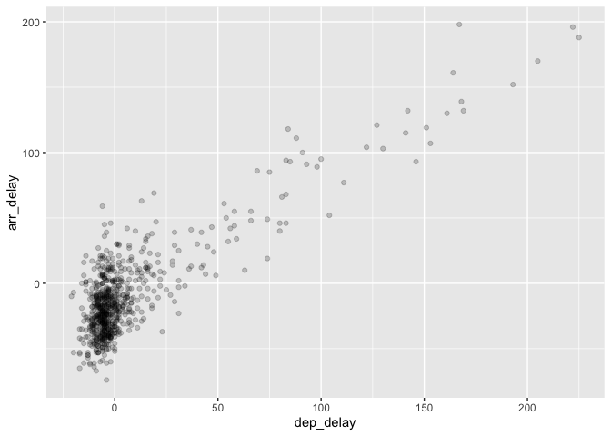

Test drive R Markdown
================
hfisicaro
2023-01-05

Una única sentencia.

``` r
library(nycflights13)
library(dplyr) 
```

    ## 
    ## Attaching package: 'dplyr'

    ## The following objects are masked from 'package:stats':
    ## 
    ##     filter, lag

    ## The following objects are masked from 'package:base':
    ## 
    ##     intersect, setdiff, setequal, union

``` r
library(dplyr)
library(ggplot2)

alaska_flights <- flights %>%
  filter(carrier == "AS") 

ggplot(data = alaska_flights, mapping = aes(x = dep_delay, y = arr_delay)) +
  geom_point(alpha = 0.2)
```

    ## Warning: Removed 5 rows containing missing values (`geom_point()`).

<!-- -->
